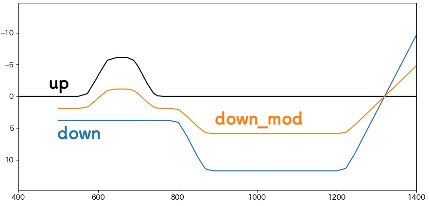

# track_modifier

[BVE Trainsim](https://bvets.net/)向けマップファイルを読み込んで、Track構文のパラメータを変換して出力するPythonスクリプト。
入力パラメータを $x_{in}$ , 変換結果を $x_{out}$ とするとき、 $x_{out} = a{x_in} + b$ の要領で変換を行う。
変換できるパラメータは、`x, y, radiusH, radiusV` の4種類。Cant関係には未対応。

## 使い方

動かすには[kobushi-trackviewer](https://github.com/konawasabi/kobushi-trackviewer) ver. 1.1.6以降が必要。

1. track_modifier.pyを適当なディレクトリに置く。
2. 次の要領で実行。

`python track_modifier.py FILE N... -o OUTPUTDIR -k TRACKKEY`

  * FILE: 読み込むマップファイルのパス
  * N...: 変換に使う係数を次の順序で記述する。省略時はa=1, b=0となる
    * xに対するa, b
	* yに対するa, b
	* radiusHに対するa, b
	* radiusVに対するa, b
  * OUTPUTDIR: 変換結果を出力するディレクトリ名。省略時は`result/`
  * TRACKKEY: 変換したい軌道キー。省略時は入力マップファイルのTrack構文全てを変換する。
  
3. 変換結果は元ファイルと同じディレクトリのresult/以下に出力される。変換後の軌道キーには`_mod`が追加される。

## 使用例

https://konawasabi.github.io/tsutsuji-trackcomputer/tutorial_first.html の作例について、up軌道, down軌道(up軌道基準に変換後)の中点を通る軌道を求める。
より具体的には、`Track['down']`要素のうち、x座標成分のみを0.5倍した結果を出力する。

入力マップファイル名を`down_converted.txt`として、入力ファイルと同じディレクトリに`track_modifier.py`を置く時、実行コマンドは以下の通り。

`python track_modifier.py down_converted.txt 0.5`

変換結果を元にマップファイルを再構成して、kobushi-trackviewerで表示させると次図を得る。

## LICENSE

Apache License, Version 2.0

